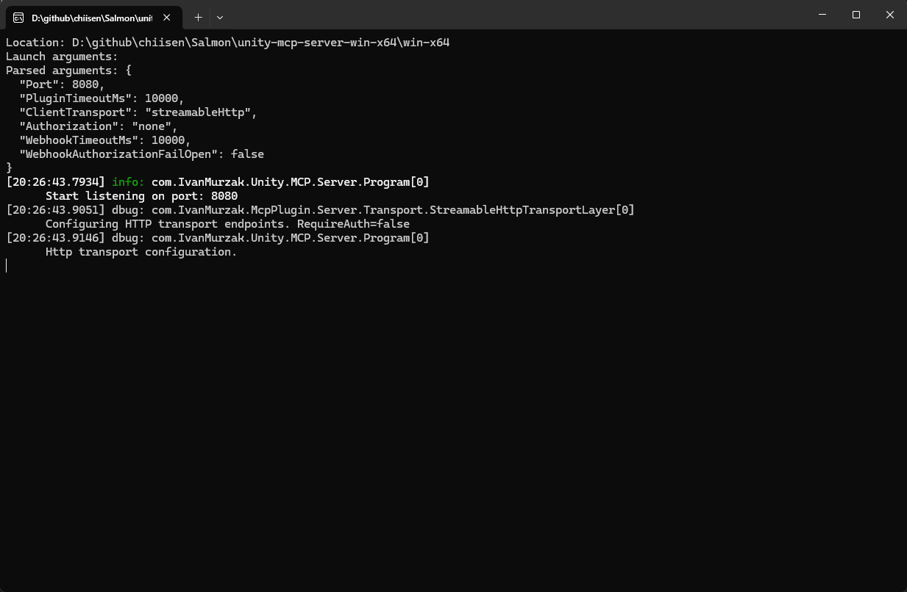

# Salmon

鮭魚逆游而上的 Unity 3D 6.4 遊戲(6000.4.1f1)。

# 輸入
預設支援搖桿遊戲。

# 執行
編譯後，請執行 `.\PC\` 目錄內的執行檔。

# MCP
https://github.com/IvanMurzak/Unity-MCP/blob/main/docs/README.zh-CN.md

## 下載 AI Game Developer (Unity MCP):
https://github.com/IvanMurzak/Unity-MCP/releases

### 下載兩個檔案:
- 解壓縮 `unity-mcp-server-win-x64.zip`
https://github.com/IvanMurzak/Unity-MCP/releases/download/0.63.3/unity-mcp-server-win-x64.zip

- 在 Unity Editor 中：`Window` → `Package Manager`:
https://github.com/IvanMurzak/Unity-MCP/releases/download/0.63.3/AI-Game-Dev-Installer.unitypackage

